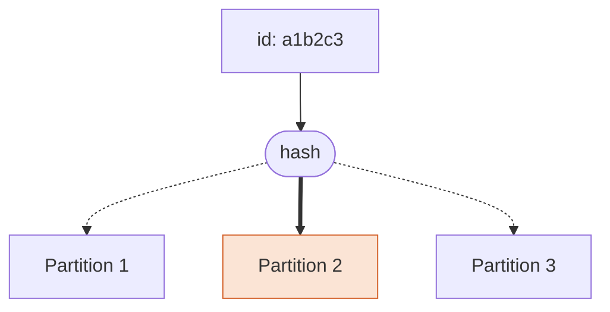
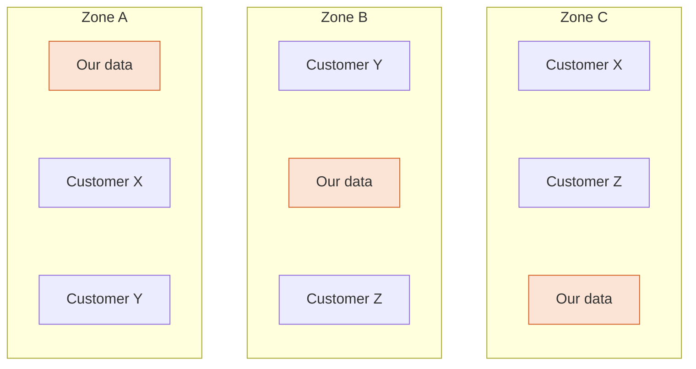
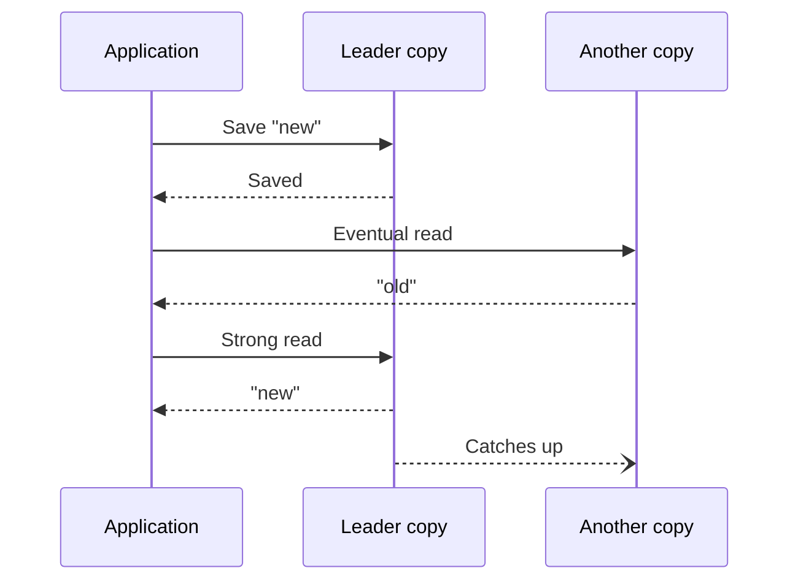
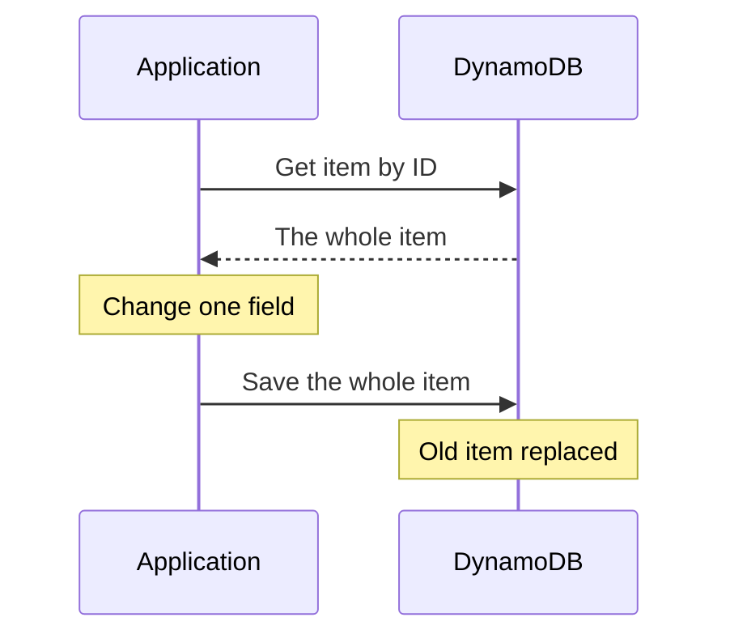

# DynamoDB <span class="accent">in Practice</span>

### How We Use It, and Why

<Byline />

<!--
Thanks for coming. Over the next twenty minutes or so I'm going to talk about DynamoDB, which is the database that sits underneath our product.

One thing to say up front: DynamoDB is an Amazon Web Services product. It isn't something you download and install, and you can't get it from Google or Microsoft. It only exists as a service inside AWS, which is where the rest of our product runs too.

This isn't a tutorial. The way things are built, the database is abstracted away well enough that most of you will rarely touch it directly. What I'm aiming for is that when a feature is being designed, built or tested, you know what the database underneath makes easy, what it makes hard, and why.

Please ask questions as I go, either out loud or in the chat.
-->

---

# What I'm going to cover

- Where it came from
- How it differs from SQL
- The core concepts
- Why it fits us
- How we use it
- Living without a schema
- Monitoring
- Upsides and downsides

<!--
Here's the plan. I'll start with a little history: where DynamoDB came from and where it sits among other databases of its kind. It's short, but it's there for a reason. Almost every limitation that comes up later is a deliberate decision, and it makes sense once you know what it was built for.

Then I'll compare it with SQL databases, which most of you will have come across, and run through the handful of concepts you need to follow the rest.

After that, why it suits us, which isn't the reason most people pick it.

The middle of the talk is how we actually use it: what our tables are and how things relate to each other. Then what it means day to day to work with a database that has no schema.

Then how we monitor it, and I'll finish with an honest look at the upsides and the downsides.
-->

---
layout: section
---

# A Bit of History

---

# Where it came from

<v-clicks>

- **2004**: Amazon's databases buckle under holiday traffic
- **2007**: the *Dynamo* paper
- **2012**: DynamoDB launches, **only on AWS**

</v-clicks>

<!--
[DIAGRAM: a horizontal timeline, 2004, 2007, 2012, 2022, would work better than bullets here. IMAGE option: the first page of the 2007 Dynamo paper.]

The story starts in 2004. Amazon, the shop, was running on large relational databases, and during the peak holiday period those databases were struggling and causing outages. When the engineers looked at how the databases were actually being used, they found that most of the access was very simple: fetch one thing by its ID. Very little of it used the powerful relational features. So they were paying for flexibility they weren't using, and getting reliability problems they couldn't afford.

Their answer was to build their own database internally, called Dynamo, and in 2007 they published a paper describing it. It was designed around the shopping basket. "Add to basket" must never fail, it must be fast no matter how many customers there are, and nobody needs to run a clever report across everybody's baskets. That paper became one of the most influential in the whole NoSQL movement.

Then in 2012 AWS launched DynamoDB as a service anyone could use. It's worth knowing that DynamoDB is not the same thing as Dynamo. Teams inside Amazon liked how Dynamo scaled but didn't like having to run it themselves. DynamoDB took the same ideas for scaling and made it a fully managed service, so there is nothing to run.

Despite the name, it's quite a different design from the one in the paper. The original Dynamo was a pure key-value store. The value was an opaque blob, the database had no idea what was inside it, and all you could do was fetch it or replace it by its key. Any copy of the data could accept a write, and if two copies ended up disagreeing, sorting that out was left to the application.

DynamoDB kept the way data is spread across machines by its key, and changed most of the rest. It understands the structure inside an item. It can keep related items together in sorted order. And each piece of data has one copy in charge of it, which is what makes it possible to offer strong consistency, something I'll come back to.

Since then it has gained a lot of features, indexes, support for JSON documents, automatic scaling, backups, transactions, but the core model is the same as it was in 2012.

Aside: one of the authors of that 2007 paper is Werner Vogels, who is Amazon's CTO. And two other well-known databases, Cassandra and Riak, are direct descendants of it. Cassandra was started at Facebook by another of the paper's authors.

Aside: the original Dynamo cared about staying available so much that it would accept two conflicting writes and merge them afterwards. The famous side effect was that something you'd deleted from your basket could occasionally come back. DynamoDB doesn't behave that way.
-->

---

# The NoSQL family

| Type | Examples |
| --- | --- |
| **Key-value** | Redis, **DynamoDB** |
| **Document** | MongoDB, Firestore, **DynamoDB** |
| **Wide-column** | Cassandra, Bigtable |
| **Graph** | Neo4j, Neptune |

<div v-click>

Built like a **wide-column** store, used like a **document** store

</div>

<!--
[DIAGRAM: a small sketch per family showing the shape of the data: a key pointing at a value, a nested document, a wide row, and nodes joined by lines. Could replace the Examples column or sit alongside the table.]

DynamoDB is what's called a NoSQL database, so let me explain what that means.

A traditional SQL database, things like Postgres, MySQL, Oracle or SQL Server, stores data in tables with rows and columns, a bit like a set of strict spreadsheets. Every row in a table has the same columns, the database enforces that, and you link tables together and ask questions using a language called SQL. They've been around since the 1970s and they're very good at what they do.

NoSQL is really just a label for everything that doesn't work that way. These databases appeared in the late 2000s when companies like Amazon, Google and Facebook hit a scale that a single SQL server couldn't handle. Broadly, they give up some of what SQL offers, fixed structure, linking tables together, sometimes strict guarantees about consistency, and in return they're easier to spread across many machines and more flexible about the shape of the data.

It isn't one thing though. There are four main families, and they solve quite different problems.

Key-value is the simplest. You give it a key and get back a value, like a giant dictionary. The best known is Redis. Redis keeps its data primarily in memory rather than on disk, which makes it extremely fast, so it's mostly used as a cache or for short-lived data like sessions, rather than as the main place you keep things.

Document databases store each record as a document, essentially a JSON object, and the database understands what's inside it. MongoDB is the one most people have heard of. Firestore is Google's, and is popular with web and mobile apps.

Wide-column databases, like Cassandra and Google's Bigtable, are built for enormous volumes of data being written constantly. Cassandra is used by the likes of Netflix and Apple. They're powerful but they take real effort to run.

Graph databases, like Neo4j and AWS's Neptune, store things and the relationships between them. They're for when the connections are the interesting part: social networks, recommendations, fraud detection.

You can see DynamoDB appears twice. At heart it's a key-value store, but unlike Redis it stores data durably on disk, and it also understands JSON-style documents. We use it as a document database, and I'll come back to that.

The one comparison worth making is with MongoDB, because that's what most people picture when they hear "document database". Mongo lets you search on any field in your documents. DynamoDB is much stricter: you have to decide up front how you're going to look data up. What you get in return is that there are no servers to look after at all. So, less to run, but less freedom in how you query.

There's a twist though. In how it's actually built, DynamoDB is closer to the third family, wide-column, than to either of the two I've listed it under. Like Cassandra and Bigtable, it groups rows together by one key and keeps them sorted by a second, and every row can have its own set of columns. So the honest description is that it's built like a wide-column store, and we use it like a document store.

Aside: a note on terminology, because it's easy to mix up. Wide-column is not the same as a columnar database. Columnar databases, like Amazon Redshift, store data column by column instead of row by row, and they're built for analytics over huge data sets. That's a different thing altogether, and it's exactly the kind of work DynamoDB is bad at.

Aside: the name "NoSQL" came from a hashtag for a meetup in San Francisco in 2009. It stuck, even though it describes what these databases aren't rather than what they are. People often read it as "not only SQL" these days.

Aside: Bigtable is the other founding paper of this whole movement, published by Google in 2006, a year before Amazon's Dynamo paper. Most NoSQL databases trace their ideas back to one or both of them.
-->

---
layout: section
---

# DynamoDB vs SQL

---

# Two different starting points

<div class="grid grid-cols-2 gap-8">
<div>

### SQL

<v-clicks>

- Model the **data**
- Ask any question later
- Database enforces the schema

</v-clicks>

</div>
<div>

### DynamoDB

<v-clicks>

- Model the **questions**
- Ask only what you planned for
- Application enforces the schema

</v-clicks>

</div>
</div>

<!--
[DIAGRAM: on the SQL side, three or four small tables joined by lines. On the DynamoDB side, one document with the same data nested inside it. This is the picture people will remember.]

This is the most important slide in the talk, because it's the change in thinking that everything else follows from.

With a SQL database you start by modelling your data. You work out what the things in your system are, customers, orders, products, you give each its own table, and you split them up so that nothing is stored twice. Then, later, you can ask more or less any question you like, and the database works out how to answer it. If someone comes up with a new question next year, you write a new query.

With DynamoDB you start from the other end. You begin by listing the questions the application is going to ask: "get me this thing by its ID", "list the things that belong to this owner". Then you design the data so that each of those questions is a quick, direct lookup. The flip side is that a question you didn't plan for may not be answerable without extra work.

If you're less familiar with SQL, the key feature I'm referring to is the join. A join is the database stitching rows from two tables together when you ask, for example, an order together with the customer who placed it. DynamoDB has no equivalent. The application either fetches the two things separately, or stores them together in the first place.

The third line is about who enforces the rules. A SQL database will reject a row that has a missing column or the wrong type of value. DynamoDB checks almost nothing. It's up to our application code to make sure what gets saved is the right shape.

This also explains how each one scales. A SQL database generally grows by moving to a bigger server. Because DynamoDB only ever does these simple direct lookups, it can spread the data over as many machines as it needs.

Aside: relational databases come from the 1970s, when disk space was the expensive part. Storing each fact exactly once was partly about saving space. Today storage is cheap and processing is what costs money, so storing data in the shape you read it, even with a bit of duplication, is a perfectly reasonable trade.

Aside: confusingly, DynamoDB does offer a SQL-like language, called PartiQL. It's only the syntax. It doesn't add joins or let you search on any field efficiently, so it doesn't change anything I've said here.
-->

---

# The trade

<div class="grid grid-cols-2 gap-8">
<div>

### What you give up

<v-clicks>

- Joins
- Ad-hoc queries
- Aggregates
- Constraints

</v-clicks>

</div>
<div>

### What you get

<v-clicks>

- No servers
- Consistent speed
- No migrations
- Effortless scaling

</v-clicks>

</div>
</div>

<!--
So here's the trade in summary. I'll be upfront about what you give up first.

Joins we've just covered. The database won't combine data from different tables for you.

Ad-hoc queries: you can't just ask "show me everything where this field equals that" unless you planned for it. That affects support and debugging as much as it affects features.

Aggregates are things like counting, adding up and grouping. "How many of these do we have?" is not a question DynamoDB answers cheaply. You either keep a running total yourself, or copy the data somewhere else to analyse it.

And constraints. There's nothing in the database making sure a reference points at something that exists, or that a value is unique, or that a number is actually a number.

None of those are impossible. But each of them becomes something we do in application code, or something we do by exporting the data elsewhere.

On the right is what you get in exchange, and the rest of this talk is really about these four. There are no servers to patch or upgrade. A lookup takes the same time whether the table has a thousand items or a billion. Adding a field is a code change, not a database migration. And it grows without us having to redesign anything.

Aside: transactions, where several changes either all happen or none do, do exist in DynamoDB. You can write up to a hundred items in one go. It's the exception rather than the normal way of working, though, and it costs twice as much.
-->

---
layout: section
---

# The Core Concepts

---
layout: two-cols
---

# Items and keys

<v-clicks>

- **Table**: a collection of items
- **Item**: one record, like a JSON object, up to **400 KB**
- **Key**: how you find it

</v-clicks>

```json
{
  "id": "a1b2c3",
  "name": "Example",
  "tags": ["one", "two"],
  "settings": { "enabled": true, "limit": 10 }
}
```

::right::

<div class="pt-14 pl-6">



</div>

<!--
There are only three terms you need.

A table is a named collection of things. Unlike a SQL table, there are no columns to define. You create it, tell it what the key is, and that's it.

An item is one record in a table. You can think of it as a JSON object, and there's an example on the slide. It has simple values like the name, a list of tags, and a nested object for settings. Two items in the same table can have completely different fields. DynamoDB doesn't mind.

There is a size limit. A single item can be at most 400 kilobytes, and that includes the names of the fields as well as their values. That's a lot of text, so we rarely get near it, but it's a hard limit. It's why you wouldn't store a file in an item, or a list that keeps growing forever.

The one thing every item must have is its key, here it's the `id` field. The key is how you find the item again.

What makes DynamoDB fast is what it does with that key, which is what the diagram shows. It runs the key through a calculation, called a hash, that tells it exactly which partition the item is stored on. A partition is a slice of the table, held on its own machine. It never searches. That's why looking something up by its key takes the same few milliseconds whether there are a thousand items in the table or a billion.

A key can optionally have a second part, called the sort key. Items that share the first part are stored together, in order of the second part. That lets you fetch a group of related items in one go.

Aside: the key has its own limits. The first part can be up to 2 kilobytes and the second part up to 1 kilobyte, and nested data can go 32 levels deep. We're nowhere near any of those.

Aside: the two parts of the key are properly called the partition key and the sort key. In code and older documentation you'll also see "hash key" and "range key". They're the same thing, the names changed and the old ones never quite went away.
-->

---

# Data types

<v-clicks>

- Text, numbers, booleans, lists, maps, sets
- **No date type**
- Every value carries its type

</v-clicks>

```json
{
  "id":      { "S": "a1b2c3" },
  "count":   { "N": "10" },
  "enabled": { "BOOL": true },
  "created": { "S": "2026-10-05T09:30:00Z" },
  "tags":    { "L": [{ "S": "one" }, { "S": "two" }] }
}
```

<div v-click>

Looks like JSON. Isn't stored as JSON.

</div>

<!--
I said an item is like a JSON object, and I need to qualify that, because the differences do catch us out.

DynamoDB has its own set of data types. There's text, which it calls a string. Numbers. Booleans, so true or false. Lists and maps, which are its versions of JSON's arrays and objects. And a few that JSON doesn't have at all: sets, which are lists with no duplicates and no order, and raw binary data.

What's on the slide is what an item really looks like when it travels to and from DynamoDB, and it has a slightly odd structure. Every value is wrapped in a little object that says what type it is. So the id isn't just the text "a1b2c3". It's an object with an "S", for string, and then the value. The count has an "N" for number. The list has an "L", and then each thing inside the list is wrapped in its own type as well.

Look closely at the number. It's sent in quotes, as text, even though it's a number. That's deliberate. Different programming languages handle numbers slightly differently, and sending it as text means nothing gets rounded on the way.

So is it JSON or not? This format is written in JSON, and JSON is what's used to send data back and forth. But DynamoDB doesn't store JSON. It stores its own typed values, and JSON is just the packaging used in transit. AWS say exactly that in their documentation. The clean version I showed you on the previous slide, without the type letters, is a convenience. Our code and the AWS console translate between the two for us.

Most of the time that translation is invisible. Where it shows is when you look at raw data, in the console, in an export or in a log, and it's in this form. And it shows when a value doesn't have an obvious type to translate into.

The main example of that is dates, and it's the one that causes us real problems. There is no date type. A date and time has to be stored as something else: either as text, usually in the standard format on the slide, or as a number counting seconds from a fixed point in 1970.

Because the database has no idea it's a date, it can't check it and it can't tidy it up. If one part of the code writes a date with a time zone and another writes it without, or one includes fractions of a second and another doesn't, both are stored exactly as given. They are just two different pieces of text. Comparing or sorting them only works if every item uses precisely the same format.

[TODO: our actual date problems: which formats we've ended up with, where it has bitten us, and what our convention is now.]

This is the schemaless problem again, which I'll come to later. The database doesn't enforce a format, so keeping it consistent is entirely up to our code.

Aside: in the AWS console there's a switch on the item view, labelled "View DynamoDB JSON", which flips between the plain version and this typed version. It's worth trying once just to see it.

Aside: DynamoDB can delete items automatically at a given time, and for that feature the time has to be a number of seconds. A date stored as text won't work, and it won't give an error either. The item just never expires.

Aside: numbers can have up to 38 digits of precision, which is more than most programming languages handle natively. That's another reason they travel as text.

Aside: a set can't be empty. If you remove the last thing from a set, the field has to be removed altogether. It's a small thing, but it's the kind of surprise you get from a type that JSON doesn't have.
-->

---

# Reading data

<v-clicks>

- **Get**: one item, by its **whole** key
- **Query**: items sharing a partition key
- **Scan**: the whole table

</v-clicks>

<br>

<div v-click>

**Index**: the same data, with a different key

</div>

<!--
[DIAGRAM: the same small table drawn twice, once ordered by ID and once by owner, to show an index as a second copy with a different key. Optionally arrows for Get (one row), Query (a group of rows) and Scan (all rows).]

There are three ways to read data out, and I've listed them from cheapest to most expensive.

Get fetches one item by its key. It's the fastest and cheapest thing DynamoDB can do, and it's what we do most of the time.

There's a detail here that catches people out. A get needs the whole key. Remember the key can have two parts, the partition key and the sort key. If a table's key has both parts, then to get an item you must supply both, exactly. You can't do a get with only the first part, because the first part on its own doesn't identify one item. It identifies a group of them.

If a table's key is just a single ID, which is the simple case, then the ID is the whole key and none of this matters.

Query is what you use when you only have the first part. It fetches all the items that share a partition key, and if you want, you can narrow that down using the sort key, for example everything after a certain date. It still goes straight to one partition, so it's still fast. But it gives you back a list, even if that list turns out to contain one item, where a get gives you back exactly one item or nothing.

[TODO: say which of our tables have a two-part key, if any, so people know where this applies.]

Scan reads the entire table, start to finish. I'll come to that on the next slide, because it gets one to itself.

So what if you need to look something up by a field that isn't the key? That's what an index is for. Say the table is keyed by ID, but we also need to find all the items that belong to a particular owner. We add an index keyed by owner. Behind the scenes DynamoDB keeps what is effectively a second copy of the data, organised by owner, and keeps it up to date for us automatically. We can add indexes to a table later on, and each one costs a bit more in storage and in writes.

One difference from the table itself: you can never do a get on an index, only a query. An index doesn't require its keys to be unique, two items can have the same owner, so a lookup through an index always gives back a list.

There's one catch that's worth knowing about, particularly if you're testing. An index is always a moment behind the table. When you save an item, it's in the table immediately, but it takes a short time, usually well under a second, to appear in the index. The term for this is eventual consistency.

In practice that means if a list on screen comes from an index, and you create something and immediately look for it in that list, it might not be there yet. That's a real source of flaky automated tests, and of the occasional "it didn't show up until I refreshed" bug report. It isn't a bug in the usual sense, it's how the database works, and it needs designing around.

Aside: there are actually two kinds of index, global and local. Local ones have to be created at the same time as the table and are more restricted. When people just say "index" they nearly always mean a global one.
-->

---

# Scaling and capacity

<v-clicks>

- Storage scales **automatically**
- Throughput is **provisioned**
- **Burst** absorbs short spikes
- Past that: **throttling**

</v-clicks>

<Todo>

How capacity is set and changed for our tables: auto scaling or manual, and how often it's reviewed.

</Todo>

<!--
[DIAGRAM: a line chart sketch with a flat provisioned line, a consumed line that spikes above it, the spike shaded as burst, and a longer spike marked as throttled. A real screenshot showing this would be even better.]

There are two different kinds of scaling here, and they work differently.

The first is storage, how much data we hold. That's completely automatic. As a table grows, DynamoDB splits it into more partitions by itself. There's no redesign, no downtime, no decision for us to make, and lookups stay just as fast. To give a sense of the ceiling, as a service DynamoDB handles tables of hundreds of terabytes and millions of reads per second. We are a very long way from either.

The second is throughput, how many requests per second we can make, and that's the one we choose. We use what's called provisioned capacity. For each table we tell AWS how many reads and writes per second we need, and we pay for that amount whether we use it or not. The alternative is called on-demand, where you simply pay per request. Provisioned works out cheaper when traffic is steady and predictable, and it gives us a predictable bill.

Now, traffic isn't perfectly smooth, and that's where burst comes in. When we use less than we've provisioned, DynamoDB banks the unused capacity, up to five minutes' worth. If we then get a short spike, it spends that reserve to cover it. It's a safety net rather than something to rely on.

If we go beyond the provisioned amount and the burst reserve, we get throttled, which means DynamoDB rejects requests. Our application automatically retries those after a short wait, so what users tend to see first is things getting slow, rather than errors.

[TODO: how capacity is set and changed for our tables, auto scaling or manual, and how often we review it.]

Changing the provisioned amount is just a setting. It takes effect within moments and there's no downtime.

Aside: that capacity is divided up between the table's partitions. So if one particular key is extremely busy, requests for it can be throttled even though the table as a whole looks fine. It's known as the hot partition problem. DynamoDB now moves capacity towards busy partitions automatically, so it's much rarer than it used to be.

Aside: we can increase capacity as often as we like, but AWS limits how many times a day we can reduce it.

Aside: AWS halved the price of on-demand in late 2024, which changed the sums on which option is cheaper. It's worth revisiting the choice from time to time.
-->

---

# Why we don't scan

<v-clicks>

- Reads **every item**, then filters
- You pay for what it **read**
- Slower as the table grows
- Starves real traffic

</v-clicks>

<br>

<div v-click>

Need a new lookup? Add an index.

</div>

<!--
[DIAGRAM: a grid of many items all highlighted as "read", with three picked out as "returned". Next to it the same grid with an index, where only the three are touched.]

I've given scan its own slide because it's the easiest mistake to make, especially if you're used to SQL.

In SQL you can filter on any column. If there's no index on it the query is slow, but it works, and you can add an index later. A scan with a filter in DynamoDB looks like the same thing, and it's tempting for the same reason. But there's an important difference in how it works. DynamoDB reads every single item in the table first, and only then throws away the ones that don't match.

That has three consequences.

First, cost. We're charged for what it read, not for what it returned. If a scan gives back three items out of a million, we've paid to read a million.

Second, speed. It gets slower as the table grows. On a test environment with a few hundred items it'll come back instantly. In production with real data it could take minutes. So "it was quick when I tried it" tells you nothing at all about a scan.

Third, and this is the one that hurts, it can starve real traffic. As I've just explained, each table has a budget of reads per second. A scan and our real users share that budget. A big scan can use it all up, and then ordinary requests from real users start getting rejected.

So we have a simple rule. If we need to look data up in a new way, we add an index. We don't scan.

This is useful to know when you're writing or reviewing a ticket. A feature that "just needs to filter by X" might be trivial, or it might need a new index, depending on whether X is already part of a key. It's worth asking that question early.

There are legitimate uses for a scan: one-off scripts and data fixes. But those are run deliberately, slowed down on purpose, and ideally at a quiet time.

Aside: for the developers, it's quite easy with Spring Data to write a repository method that looks innocent and turns into a scan underneath. The library makes you opt in explicitly with an annotation, which is a helpful thing to look out for in code review.

Aside: if anyone wants the actual numbers, capacity is measured in units. One read unit lets you read one item of up to 4 kilobytes per second. So scanning a million items of a couple of kilobytes each uses something like a quarter of a million read units.
-->

---

# In code: reading

<Todo>

Code snippets from our codebase: a get by ID, a query through an index, and what a scan looks like so it can be recognised in review.

</Todo>

<!--
[TODO: script once the snippets are in. Keep each snippet to a few lines, and remove anything that names the product.]

Here's what those three kinds of read look like in our code.

[Walk through the get by ID: this is the cheap, direct lookup, and it's most of what we do.]

[Walk through the query through an index: point out which index it uses, and remind people this is the one that can be a moment behind.]

[Show what a scan looks like, and what to look for in a code review that tells you a method will scan.]

The thing to notice is how similar they look. A fast lookup and a full table scan can be one line each and almost identical, which is why it's worth knowing the difference.
-->

---
layout: two-cols
---

# A shared service

<v-clicks>

- No server of our own
- Shared with other AWS customers
- Our data is split into **partitions**
- Three copies, in three **availability zones**
- All within one **region**

</v-clicks>

::right::

<div class="pt-14 pl-6">



</div>

<!--
It's worth understanding what we're actually getting, because it's quite different from the traditional picture of a database.

Traditionally a database is a machine. Either a physical server in a rack somewhere, or a virtual one that we rent, but either way it's ours, it has a size, and all of our data sits on it.

DynamoDB isn't like that. There is no server that belongs to us. AWS run an enormous fleet of machines, and that fleet is shared between all of their DynamoDB customers. Our data sits on the same hardware as other companies' data.

That naturally raises the question of whether that's safe. AWS keep each customer's data completely separate. Nobody else can see ours and we can't see theirs, every request has to prove it's allowed to access our tables, and the data is encrypted where it's stored. The sharing is about hardware, not about access.

It also means our data isn't all in one place. As I said earlier, a table is split into partitions. As it grows it's split into more of them, and those partitions are placed on different machines.

To explain where those machines are, I need two AWS terms. A region is a geographic area where AWS operate, such as London, Ireland or Northern Virginia. Each region is divided into availability zones. An availability zone is one or more data centres with their own power, cooling and network connections, physically separated from the other zones in that region by a meaningful distance, so that a fire, a flood or a power cut at one doesn't take out the others.

Every partition is stored three times, and the three copies are deliberately placed in three different availability zones. That's what the diagram is showing. Ours is the highlighted one, with one copy in each zone, sitting alongside other customers' data.

So if a single machine fails, there are two other copies and DynamoDB quietly builds a replacement. If an entire availability zone goes offline, which is rare but does happen, there are still two copies in the other two zones, and the table carries on working. We don't have to do anything, and in most cases we wouldn't even notice.

We didn't configure any of this and we can't turn it off. Every DynamoDB table works this way. With a traditional database, running copies in several locations is something you have to set up, pay extra for and test.

All three zones are in the same region, and that's the boundary. Our data stays inside that one region. It's close enough together that keeping the copies in step is fast, and it means we know which country the data is in.

[TODO: say which region we're in, and why if there's a reason such as data residency.]

This sharing is what makes the low maintenance possible. Because the hardware is pooled, AWS can replace machines, apply updates and move data around behind the scenes without us being involved or even aware of it. It's also why we pay for what we use rather than for a server that sits mostly idle.

Aside: the technical term for this is multi-tenant. We're one tenant among many. The alternative, where you get dedicated hardware, is called single-tenant.

Aside: there's a classic downside to sharing called the noisy neighbour problem, where another customer's heavy usage slows you down. DynamoDB is designed specifically to prevent that, which is a large part of what Amazon's 2022 paper on DynamoDB is about. It's also why capacity limits and throttling exist: they protect everyone from each other.

Aside: what this doesn't protect against is the loss of a whole region. For that, DynamoDB has a feature called global tables, which keeps copies in more than one region. It costs more and adds complexity, and most systems, including a lot of very large ones, don't use it.

[TODO: confirm whether we replicate to another region, and adjust or drop that aside.]

Aside: it isn't only the data that's spread like this. The parts of DynamoDB that receive and route our requests run in all three zones too.
-->

---
layout: two-cols
---

# Consistency

<v-clicks>

- Dynamo chose **uptime** over consistency
- DynamoDB lets you choose, per read

</v-clicks>

::right::

<div class="pt-14 pl-6">



</div>

<!--
I've just said that everything is stored three times. That raises a question, and how you answer it is one of the biggest decisions in any database like this.

First, what do I mean by consistency? It's simply this: if I save something and then immediately read it back, do I get what I just saved? With a single database on a single machine the answer is obviously yes. With three copies on three machines it's less obvious. When I save, it takes a moment for all three copies to be updated. If my next read happens to land on a copy that hasn't caught up yet, I get the old value.

There are two ways to deal with that. Strong consistency means the database guarantees you always get the latest value, whatever it has to do to make sure. Eventual consistency means you might briefly get an old value, but all the copies will agree eventually, usually within a fraction of a second.

Go back to the history. The original Dynamo was designed above all for uptime. Remember, "add to basket" must never fail. To get that, Amazon deliberately traded away consistency. Any copy could answer, even one that was slightly out of date, because a slightly stale basket is much better than an error page. That was the right decision for them.

DynamoDB kept that as its default, but it gives you the choice, and you can make it on each individual read. An eventually consistent read can be answered by any of the three copies. A strongly consistent read is always answered by the one copy that's guaranteed to be up to date, which is called the leader.

You can see both in the diagram. The application saves a new value. An eventual read happens to reach a copy that hasn't caught up, and gets the old value. A strong read goes to the leader and gets the new one.

Aside: there's a well-known idea behind all this called the CAP theorem. Roughly, when the machines in a distributed system can't talk to each other, you have to choose between staying available and staying consistent. You can't have both. Dynamo chose availability. A traditional SQL database chooses consistency.

Aside: writes work differently from reads and aren't affected by this choice. A write is only confirmed once at least two of the three copies have safely stored it, so a confirmed write is never lost.
-->

---
layout: section
---

# Why It Fits Us

---

# Why it fits our use case

<div class="grid grid-cols-2 gap-8">
<div>

### Not for the scale

<v-clicks>

- Not millions of requests
- Not much data
- Very predictable load

</v-clicks>

</div>
<div>

### For the low maintenance

<v-clicks>

- No server to patch or upgrade
- No maintenance windows
- No connections to manage
- Backups are a setting

</v-clicks>

</div>
</div>

<!--
Amazon built DynamoDB specifically to solve problems of scale, and we're not facing scaling problems. So it's fair to ask what DynamoDB actually offers [CLIENT].

We're not handling millions of requests a second, or anything close to it. We don't store all that much data either. And our load is very predictable: we know roughly how busy we'll be at any time of day, and it doesn't change dramatically from one week to the next.

[TODO: rough figures for our own traffic and data size, to make that concrete.]

So if it isn't about scale, why use it? For [CLIENT] the advantage is that it costs very little to look after. I mean that in terms of people's time as well as the bill.

[TODO: give a ballpark figure for what DynamoDB costs us per month.]

With a traditional database, somebody has to own it. Somebody applies the updates, tests the backups, watches the disk space, tunes it when it gets slow and gets called when it falls over. In a lot of organisations that's a full-time role, a database administrator, or DBA. We don't have one and we don't need one.

There is no database server. AWS runs the whole thing. We never see a version number, an upgrade notice or a maintenance window.

Connections are a less obvious one. A SQL database can only handle a limited number of connections at a time, so applications have to manage a pool of them carefully, and running out is a classic cause of outages. DynamoDB works over ordinary web requests. There's nothing to run out of.

Backups are just a setting. Once it's switched on, we can restore a table to how it was at any second in the last 35 days.

And there's more we don't do: testing failover, managing replicas, tuning slow queries, worrying about disk space. For a team like ours, where most of the work is frontend, that matters a great deal.

In terms of hours, the time we spend maintaining the database in a normal month is close to zero. What we do spend is on reviewing capacity and cost, which I'll cover in the monitoring section.

[TODO: a real estimate of hours per month spent on database upkeep, if there is one.]

It also suits the way we work with the data. Most screens load one thing by its ID and save it back, each thing is fairly self-contained, and the ways we look things up are known and don't change much. Those are exactly the things DynamoDB is good at, so we get the low maintenance without fighting its restrictions very often.

[TODO: where it doesn't quite fit. Being honest here sets up the downsides later.]

Aside: the predictable load matters for cost as well. It's the reason we can use provisioned capacity, where we commit to a fixed amount up front, rather than paying a premium for the flexibility to handle surprises.

Aside: restoring a backup always creates a new table next to the existing one, it doesn't wind the existing one back. So recovering from a mistake means restoring alongside and copying back what's needed.
-->

---

# Our choice: strong consistency

<v-clicks>

- We choose **strong** consistency
- It costs double. For us, that's fine

</v-clicks>

<!--
Earlier I described the choice between strong and eventual consistency. We use strong consistency. When our application saves something and reads it back, it gets what it saved, every time.

That choice isn't free. A strongly consistent read costs exactly twice as much as an eventually consistent one. It can be slightly slower. And because only one of the three copies can answer, it's a little less resilient if something is going wrong inside AWS.

For many of the applications that pick DynamoDB, that would be a bad trade. If you chose it because you have enormous traffic, then doubling the cost of every read is a very large amount of money, and you'd be giving up some of the availability that was the reason for choosing it in the first place. Those teams accept eventual consistency and design their applications around it.

We're in the opposite position. We didn't pick DynamoDB for the scale, and our read volumes are modest. Doubling a small number is still a small number. What we get for it is a system that's much simpler to reason about. Developers don't have to think about stale reads, and testers don't have to wonder whether what's on screen is the latest version. That's worth far more to us than the saving.

There's one exception, which I mentioned earlier. Indexes are always eventually consistent, and there's no option to change that. So a lookup that goes through an index can still be a moment behind, even though everything else is strongly consistent.

[CODE option: the one line where strong consistency is switched on, if it's short enough to show.]

[TODO: confirm that strong consistency is on for all our reads, and say which lookups go through an index and so are the exception.]

Aside: this is unrelated to the eventual consistency you get from caching in a browser or a CDN, although the symptom, seeing old data until you refresh, looks exactly the same. If something looks stale, the database is no longer the first suspect.
-->

---
layout: section
---

# How We Use It

---
layout: two-cols
---

# As a document database

<v-clicks>

- One item per thing
- Read by ID, change, save the **whole item**
- Nested data stays inside the item

</v-clicks>

::right::

<div class="pt-14 pl-6">



</div>

<!--
So that's the theory. This is how we actually use it, and the short version is: as simply as we can.

We treat DynamoDB as a document database. Each thing in the system is stored as one item, and what's stored looks very much like the object the application works with, which in turn isn't far from the JSON the frontend receives.

The typical operation is the one in the diagram: fetch the item by its ID, change something, and save the whole thing back.

That "whole thing" is worth dwelling on, and it comes from DynamoDB being a key-value store at heart. A key-value store has a key and a value, and a write means "here is the new value for this key". When we save, we aren't changing one field. We're replacing the entire item with a new one. Whatever was stored under that key before is gone, and what we sent is now the item.

Compare that with SQL, where you'd typically say "update this one column on this row" and everything else is left alone. Here, even if only one field changed, the whole item is sent and the whole item is overwritten.

Most of the time you'd never notice. It matters in two situations. One is when two saves happen close together, because the second one replaces everything the first one wrote, not just the field it was interested in. The other is when the code doing the saving doesn't know about everything that's in the item, which I'll come back to when we talk about old data.

Where a SQL database would have a separate child table and a join, we keep the nested data inside the item, as a list or an object. One read gets you everything.

All of the code that talks to the database sits behind a layer of its own, so most feature work never touches DynamoDB directly.

Aside: if you go and read about DynamoDB online, you'll find a lot of advice about something called single-table design. That's a very different approach where every type of thing lives in one table, with carefully constructed keys so related items can be fetched together. It's powerful and efficient, and very hard to read or change. We don't do that, on purpose.

Aside: this is the classic trap with "read, change, save". If two people do it to the same item at the same moment, the second save overwrites the first person's change, even if they edited completely different fields. The standard fix is to keep a version number on the item and tell the database "only save this if the version is still the one I read". That's called optimistic locking.

Aside: DynamoDB can update individual fields of an item without replacing the rest. It's a separate operation that we don't generally use, because replacing the whole item is simpler and fits the way the application works with whole objects.

[TODO: confirm whether we use optimistic locking and whether we ever do partial updates, and keep or drop those two asides.]
-->

---

# In code: an item

<Todo>

Code snippets from our codebase: a model class showing the key and a few fields, and a read, change, save.

</Todo>

<!--
[TODO: script once the snippets are in. Pick a small model, or trim one down, and remove anything that names the product.]

This is what that looks like in practice.

[Walk through the model class: this class is the schema. Point out which field is the key, and that nothing in the database knows about the rest.]

[Walk through the read, change, save: fetch by ID, change a field, save. Point out that the save sends the whole object, not just the field that changed.]

Notice there's nothing about DynamoDB in the code that uses it. That's what I meant by it being abstracted away.
-->

---

# Our tables

<Todo>

The tables and what each one holds. For each: its key, its indexes, and the questions each one answers.

</Todo>

<!--
[TODO: script for this slide once the content is in.]

Here are the tables we have. For each one I'll say what it holds, what its key is, and which questions it answers.

[Walk through each table. Call back to "model the questions": each index exists because of a specific lookup the application needs.]

It's worth noticing which of these lookups go through an index, because those are the ones that are a moment behind, as I mentioned earlier.
-->

---

# How associations work

<Todo>

How items reference each other: stored IDs, embedded copies, lookups via an index. One worked example of following a relationship.

</Todo>

<!--
[DIAGRAM: two items, one holding the other's ID with an arrow between them, next to a version where a copy is embedded. Use generic names if the real ones are sensitive.]

In a SQL database, relationships between things are built in. Here they're our responsibility, so this is how we handle them.

[TODO: how our items reference each other, with one worked example of following a relationship.]

There are a few consequences of this that are true however we do it.

There's nothing in the database guaranteeing that a reference points at something that still exists. If one item holds the ID of another, and that other item gets deleted, nothing stops that and nothing tells us. So code that follows a reference has to cope with finding nothing there.

Following a reference is a second request. If we load a list of ten things and then need something related to each one, that's potentially eleven requests rather than one.

The alternative is to store a copy of the related data inside the item. That saves the second request, but the copy can go out of date when the original changes. It's the right choice when the data rarely changes, or when a snapshot at that moment is actually what we want.

And deleting doesn't cascade. If we remove something, removing everything that hangs off it is our job too.

Aside: for the "eleven requests" problem, DynamoDB lets you fetch up to a hundred items by key in a single request, which is how it's usually solved.
-->

---
layout: section
---

# Living Without a Schema

---

# Schemaless

<v-clicks>

- The database only knows the **key**
- Our code is the schema
- Any item, any shape

</v-clicks>

```json
{ "id": "a1", "name": "Old item" }
{ "id": "b2", "name": "New item", "status": "active", "tags": ["one"] }
```

<!--
[DIAGRAM: could replace the JSON with a picture of one table holding items of visibly different shapes.]

I mentioned earlier that DynamoDB doesn't enforce the shape of our data. The word for that is schemaless, and it deserves a couple of slides, because it's both the thing that speeds us up the most and our biggest hurdle in how we develop.

A schema is the definition of what your data looks like: what fields there are, what type each one is, which are required. In a SQL database the schema lives in the database, and the database enforces it. Try to save a row with a missing column or text where a number should be, and it refuses.

DynamoDB knows about exactly one thing: the key. Every item must have one. Beyond that it will store whatever we give it. The two items on the slide can sit side by side in the same table. One has two fields, the other has four, and DynamoDB is perfectly happy.

That doesn't mean we have no schema. We do. It's just that it lives in our application code rather than in the database. The code decides what gets saved and what it expects to find when it reads.

The important thing to take from this slide is that the schema in our code only describes what we write today. The table contains everything we have ever written, by every version of the code there has ever been. Those two things are not the same.

Aside: there is one part that is fixed, and that's the key itself. Once a table is created its key can't be changed. Changing it means creating a new table and copying everything across.

Aside: types aren't enforced either. Nothing stops a field being a number in one item and text in another. Our code would have to do that by mistake, but if it did, the database wouldn't object.
-->

---

# No migrations

<v-clicks>

- New field? Just a code change
- Nested data? No new table
- No database change to roll back

</v-clicks>

<br>

<div v-click>

Faster to build, simpler to release

</div>

<!--
Let's start with the good side, because for the developers this is probably the biggest day-to-day difference from working with a SQL database.

In a SQL project, adding a field means writing a migration, a script that changes the database structure. Someone has to review it. You have to decide what value existing rows get. You have to think about whether the old version of the code still works while the migration is running, and whether things need releasing in a particular order.

Here, you add the field to the code and start saving it. That's it.

It's the same for nested data. A list of child things in SQL means a new table and a join. Here it's a list inside the item. No new table to create.

And if a release has to be reverted, there's no database change to undo.

All of that makes features quicker to ship, and it removes a whole category of deployment problems. Nobody has to write or review SQL. It also makes it cheap to try something out. If an idea doesn't work, we remove the code and there's nothing to tidy up in the database.

Aside: migrations are one of the more common causes of failed releases in SQL projects. A migration that takes seconds on a test database can lock a production table for minutes. That whole risk simply doesn't exist here.

[TODO: confirm "no new tables" holds for a brand new type of thing, or whether that does need a table creating in infrastructure, and adjust the wording.]
-->

---

# Our biggest hurdle

<v-clicks>

- Old data never updates itself
- **Reads** must cope with every old shape
- **Writes** must not damage old items
- Old and new code run side by side

</v-clicks>

<br>

<div v-click>

Test against old data, not just new

</div>

<!--
[DIAGRAM: a timeline of code versions, v1, v2, v3, above a table containing items written by each. A second one for releases: old and new versions of the app running at the same time against the same table.]

Now the other side, and this is the biggest hurdle in how we develop.

When we change the code, the data that's already in the table doesn't change with it. An item saved a year ago still looks exactly the way the code wrote it a year ago, and it will stay that way until something saves it again. There is no default value that gets filled in, and no migration that brings everything up to date.

So every time we change how we read or write something that already exists, we have to think about the data that's already there.

Take reads first. If we add a field, older items don't have it. Any code that reads that item has to cope with it being missing: the backend, and often the frontend too, because the field will be absent from what the API returns. If the code assumes it's always there, it works perfectly on everything created recently and fails on the older records. One old item in a list can be enough to break the whole page.

Writes need just as much care. Remember that a save replaces the whole item. Our normal pattern is read the item, change it, save it back. If the code that saves it has a different idea of the item's shape from the code that originally wrote it, anything it doesn't know about isn't in what it sends, so saving can quietly change or lose data that we never meant to touch.

The fourth point is easy to forget. During a release, the old version and the new version of the application are both running for a while. So old code will read items written by new code, as well as the other way round. And if we roll a release back, the old code is left dealing with whatever the new code saved in the meantime. Changes need to work in both directions.

Some changes are safe and some aren't. Adding an optional field is safe. Renaming a field is not: as far as the database is concerned, the old name and the new name are two unrelated fields, so every existing item appears to have lost its value. Changing a field's type, or making an optional field required, are the same kind of problem.

When we do need to change existing data, we do it in steps. First release code that can read both the old and the new shape. Then run a script that rewrites the old items, which is called a backfill. Only then remove the code that handled the old shape.

[TODO: how we actually handle this here: our conventions, any versioning of items, how backfills are run and who runs them.]

If you're testing, this is the slide to remember. Data you create today will always be in the newest shape, so it will always work. The bug is nearly always in the item that was created six months ago. And test environments usually don't have that history, so production holds shapes of data that the test environment has never seen.

[TODO: how we get realistic old data into test environments, if we do.]

There's a similar effect on indexes. An item only appears in an index if it has the field that index is keyed on. So if we add an index on a new field, older items without that field are simply missing from it. Nothing reports an error, they're just not in the results.

Aside: because the database stores whatever it's given, we can end up with leftover fields that nothing reads any more. They're harmless, but it's clutter that's hard to see.

Aside: bad data is easy to write and hard to find. If a bug saves items in the wrong shape, every save succeeds, and since we can't search freely, working out how many items are affected is a job in itself.

Aside: one common technique is to store a version number on each item, recording which shape it was written in. Code can then check the version and upgrade the item as it reads it.
-->

---

# In code: old data

<Todo>

Code snippets from our codebase: reading a field that older items may not have, and part of a backfill script.

</Todo>

<!--
[TODO: script once the snippets are in. A real example of a field that was added later works best.]

Here's how that shows up in the code.

[Walk through the read: this field was added after some items already existed, so this is how the code copes when it isn't there.]

[Walk through the backfill: read each old item, fill in the new shape, save it back. Mention that it's run deliberately and slowed down on purpose, because under the covers it's a scan.]

If you're reviewing a change that adds or alters a field, this is the question to ask: what happens when this code meets an item that was written before the change?
-->

---
layout: section
---

# Monitoring and Maintenance

---

# What we watch

<v-clicks>

- Consumed vs provisioned capacity
- Throttled requests
- Latency and errors

</v-clicks>

<Todo>

Screenshots of usage monitoring: consumed vs provisioned capacity, throttles, latency.

</Todo>

<!--
[IMAGE: the usage screenshots go here. Annotate them with arrows or labels for provisioned, consumed and any throttling.]

There are three things we watch.

[TODO: add screenshots, and check they contain nothing sensitive such as table names or account IDs. Adjust the script to describe what's actually on screen.]

The main one is consumed capacity against provisioned capacity. For each table, this shows how much we're actually using compared with how much we've paid for, with reads and writes shown separately. The gap between the two lines is our headroom. It's also money we're spending on capacity we're not using, so we want that gap to be comfortable but not enormous.

[Point out on the screenshot: what a normal day looks like, the daily pattern, and any spike and what caused it.]

The second is throttled requests. That should be zero. If it isn't, either our traffic has outgrown what we've provisioned, or something is reading far more than it should, which usually brings us back to a scan.

The third is latency and errors. Latency, how long requests take, should be flat and just a few milliseconds. If it changes, that usually points to something we've changed, such as items getting bigger, rather than a problem with DynamoDB. Errors come in two kinds: ones that are AWS's fault, which are rare, and ones that are ours, like a badly formed request or a permissions problem. Those nearly always appear straight after a deployment.

Aside: all of these numbers are provided by AWS automatically and for free. We didn't have to build anything to collect them.
-->

---

# Datadog alerts

<Todo>

Screenshots of the Datadog monitors and an example alert. What triggers each, and who it goes to.

</Todo>

<!--
[IMAGE: the Datadog screenshots go here. A screenshot of an alert as it appears where people receive it is worth including alongside the monitor configuration.]

We don't want to rely on somebody happening to look at a graph, so we have alerts set up in Datadog.

[TODO: add screenshots, and check they contain nothing sensitive such as table names, account IDs or channel names.]

[For each alert: what it measures, the threshold that triggers it, and who gets told.]

When one of these fires, this is what happens.

[TODO: where it shows up, who looks at it, and the first steps.]

The first questions are usually the same. Is it one table or all of them? Is it reads or writes? Did a deployment just go out? Is somebody running a script?

[TODO: if there's a real example of an alert catching something, tell that story here. It's more memorable than the configuration.]
-->

---
layout: section
---

# Upsides and Downsides

---

# Upsides and downsides

<div class="grid grid-cols-2 gap-8">
<div>

### Upsides

<v-clicks>

- Nothing to operate
- Fast at any size
- No migrations
- Predictable cost

</v-clicks>

</div>
<div>

### Downsides

<v-clicks>

- New lookups need new indexes
- No joins or reporting
- No schema enforcement
- Tied to AWS

</v-clicks>

</div>
</div>

<Todo>

One concrete win and one concrete pain point from this product.

</Todo>

<!--
Let me pull that together. The upsides I've mostly covered, so quickly: there's nothing for us to operate, it's fast and stays fast however much data we have, we don't write migrations, and the cost is predictable.

[TODO: one concrete win from our product.]

I want to spend a bit more time on the downsides, because they're real and they're worth knowing.

New lookups need new indexes. If a feature needs data to be found in a way we haven't needed before, there's a database cost attached. It's not a big one, but it's far better spotted when the feature is being designed than halfway through building it.

No joins or reporting. Relationships between things are our code's job. And any question across all of our data, "how many customers have done this?", can't be answered straight from DynamoDB. That affects product and support just as much as engineering.

No schema enforcement, which I've called our biggest hurdle. Bad data is easy to write and hard to find, and old data has to be thought about with every change. If a bug saves an item in the wrong shape, the save succeeds without complaint. And because we can't search freely, finding out how many items are affected is a job in itself.

And we're tied to AWS. There's nothing equivalent we could simply switch to. Moving away would mean rewriting the data layer.

[TODO: one concrete pain point from our product.]

There are also cases where DynamoDB is simply the wrong tool: heavy reporting and analytics, data that's all about many-to-many relationships, and full-text search. If we find ourselves needing those, that's a sign to add something alongside it, not to try to force DynamoDB to do it.

Aside: the usual way to fill the reporting gap is to copy the data somewhere built for the job. DynamoDB can export a whole table without affecting the live one, and it can also send out a stream of every change as it happens for other systems to pick up.
-->

---

# Summary

<v-clicks>

- Trades flexibility for simplicity
- Design around how data is read
- Documents, looked up by key
- No schema migrations, no servers, no scans

</v-clicks>

<!--
To sum up.

DynamoDB trades flexibility for simplicity. It does far less than a SQL database, and that is exactly why there's almost nothing to run.

We design around how the data is read. So the question to ask about any new feature is, "how are we going to look this up?"

We use it as a document store, one item per thing, looked up by its key, and we keep that deliberately simple.

And three things to remember: no schema migrations, no servers, no scans. Two of those are gifts, and one is a rule.

If you take one thing away from this: when a feature needs data to be found in a new way, raise it early.
-->

---
layout: section
---

# Questions?

<!--
Thank you. I'm happy to take any questions.

Answers to likely questions:

"Why not just use Postgres?" It would work. We'd gain joins and reporting, and in exchange we'd take on upgrades, managing connections, writing migrations and sizing a server. For the way we use our data, that's a poor trade.

"What if we need reporting?" We'd copy the data into something built for reporting, rather than bending DynamoDB to do it.

"How do I look at the data?" [TODO: how people here actually do that: the AWS console, a tool, a script.]

"Can we run it locally?" AWS provide a version of DynamoDB that runs on your own machine for development and tests. [TODO: say what we actually use.]
-->
