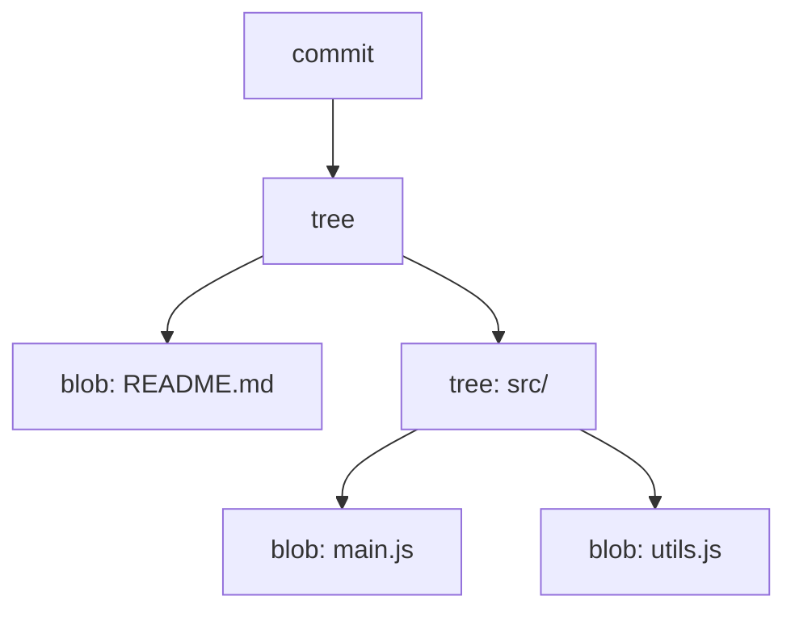
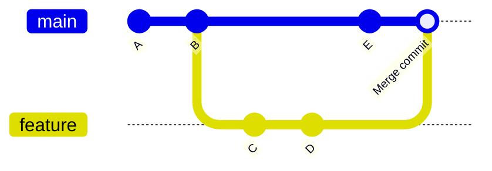
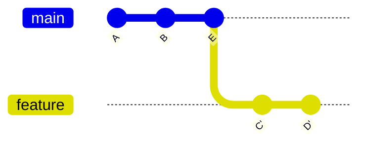

# Git Demystified

### Or: how the pieces actually fit together

<!--
Ask questions as I go. If you're reading these slides afterwards, press `S` to view my speaker notes.

Teaching principles - not tools
For demos I will solely use the command line. If that's not what you're used to don't fret it's not important to remember what I am typing, it's important to remember the concepts I'm explaining.
There will be some parts where you see me poking around with Git internals.

Not a talk about best practices or how you to use git.

If I get time at I will progress on to breaking down some common and more complex git tasks.

If I start going to fast please stop me.
-->

---


Sound Familiar?

---

# What I'm going to cover

- What git actually is — and how it's different from other version control tools
- The building blocks: blobs, trees, commits, and the staging area
- How commits chain together into history (and why your repo doesn't balloon in size)
- Branches, tags, and refs — just pointers, all the way down
- Merging vs rebasing — what's actually happening on disk
- What happens when you push, pull, and force-push
- Why none of this is actually as scary or as permanent as it looks

<!--
This isn't a "how to use git" talk, and it isn't a tour of any particular tool's UI (IntelliJ, GitHub Desktop, whatever you use day to day) - none of that is the point today. I'm not going to be dictating git commands to memorise or clicking through anyone's git GUI.

The point is the model underneath all of those tools. Every button in every git GUI, every command you type, is ultimately just reading or writing the same handful of file types in .git/ - once that clicks, the tools stop feeling like separate things to memorise and start feeling like different windows onto the same simple structure.

I will be tabbing into a terminal a few times to actually run commands and cat/ls files inside .git - not because I expect anyone to go poking around in there day to day (you shouldn't need to, and probably never will), but because seeing it for real is far more convincing than a diagram claiming "it's just a file, trust me".
-->

---

# What actually is git?

<div class="text-2xl italic my-8">
"A bunch of zipped-up text files, wearing a trench coat, pretending to be complicated."
</div>

- No server, no daemon, no database
- Everything lives in plain files under `.git/`
- Every "advanced" command — merge, rebase, reflog — is just reading or writing those files
- Today we're going to open the trench coat

<!--
This slide is the thesis of the talk. Everything after this is demystifying: showing that the scary-sounding commands later on (rebase, force-push, reflog) are just simple, inspectable file operations once you've seen what's actually inside .git.

If people remember one thing from this talk, I want it to be this one. Say it, then move on — don't over-explain yet, we're about to prove it with cat-file.
-->

---

# How is git different?

- Centralized VCS (SVN, CVS, Perforce): one server holds the history — your checkout is just a copy of one revision
- Git is **distributed**: every clone has the *entire* history — commit, branch, and browse history offline
- Old VCS mostly track *diffs* per file; git snapshots the *whole tree* on every commit
  - Snapshots are cheap: unchanged files are just re-referenced by hash, not recopied
- There's no special "the server's copy" — your local repo and `origin` are peers, one is just agreed to be canonical

<!--
Keep this one light - it's context-setting, not a deep dive. The "snapshot not diff" claim is the important one to plant here, because the next few slides (blobs, trees, commits) are literally going to prove it by showing you the snapshot structure on disk.

Worth a quick show of hands: who has used SVN/Perforce/CVS before? Calibrates how much to labour this point.
-->

---

# Fundamentals

Three things worth nailing down before we go any further:

- **DVCS** — you have the *entire* repository locally, not just a working copy. Remotes exist to share it, not to hold "the real" history
- **Hashes** — SHA-1, computed from content. Change anything, the hash changes. The same content hashed twice is the same object, stored once
- **The `.git` directory** — the whole repository lives in here, as plain files — not a database, not a service, just files on disk

<!--
These 3 ideas are the foundation everything else builds on - worth actually pausing on each rather than rushing past them, since the rest of the talk just keeps applying them over and over.

DVCS: this is the same point "How is git different" made a couple of slides ago, just landing it more concretely - being distributed means git keeps a full copy of the repository locally, separate from your working copy. Remotes are purely there to help you share it.

Hashes: git uses SHA-1, generally shown hex-encoded. `git hash-object somefile` will compute one without even touching the repo. Short hashes (`git log --oneline`) are just a truncated prefix - git gives you enough characters to stay unique, `git log` on its own shows the full thing.

The lightbulb moment to aim for here: if you change anything, the hash changes - you're never really "modifying" an object, you're creating a new one. And if two things hash the same, they're stored once. Almost everything demystifying about the rest of this talk falls out of taking that one idea seriously.

.git directory: the entire repo, no exceptions, at the root of every git project. I'll delve into it a fair bit over the next few slides - just don't go manually editing its contents on a real repo unless you really know what you're doing, git is not forgiving about a hand-edited object store.
-->

---

# Git Data Model

This is the structure that git uses to store commits.



<!--
Here we see the fundamental building blocks of everything stored in git.

One way direction Commits Point to trees, trees point to other trees and blobs, blobs don't point anywhere.
You can't work your way back up without lots of searching.

All parts are stored in the same way. So way to differentiate between the different types

All parts are stored in .git/objects

SideNote: if you run `git gc` or `git pack` then they may be stored slightly differently on disk to save space but the underlying principles are the same.

Git is one big interlocked graph. You will hopefully start to see this as we go along.
-->

---

# Commits

Represents a snapshot - contains some metadata:

- **tree**: pointer to the root tree
- **author**: author details
- **committer**: similar to author (rarely different, unless applying someone else's patch)
- **parent**: pointer to the previous commit (initial commit has none)
- **commit message**: text that should describe the commit
- occasionally some other metadata

```
tree 9c8b7a6f5e4d3c2b1a0f9e8d7c6b5a4938271605
parent 7e6d5c4b3a2918f7e6d5c4b3a29187e6d5c4b3a
author Conor Restall <conor@restall.io> 1690000000 +0100
committer Conor Restall <conor@restall.io> 1690000000 +0100

Fix login validation bug
```

<small>(the output of `git cat-file -p <commit-hash>` - hashes shortened for the slide)</small>

<!--
Tree - just a hash that points to the files in the commit - I'll come on to trees on my next slide.

Author - The person who wrote the code

Committer - the person who committed the code. These are usually the same person, unless you're applying someone else's patch.
Most git tools don't differentiate between committer and author.

Author and committer fields also include a timestamp (epoch + timezone).

Parent - parent commit. It is possible to have multiple parents - e.g. Merges.
The first commit doesn't have a parent

Lets have a look at a commit.

`git init`

`touch empty.txt`

`git add empty.txt`

`git commit -m 'initial commit - only an empty file'`

Now we have a commit in our git repo lets have a look at it.

There is a useful tool for poking around with these internals that is included in git by default `git cat-file`.

Before we can do that we need the hash of the commit `git rev-parse HEAD` will give us that

`git cat-file commit <hash>`

If we add another empty file and another commit

`touch empty2.txt`

`git add empty2.txt`

`git commit -m 'second commit - another empty file'`

and then look at the second commit we can see a parent

Any questions about commits?
-->

---

# Trees

A tree represents a directory: a list of named entries, each pointing at a blob (file) or another tree (subdirectory)

```
100644 blob a1b2c3d4e5f6...  README.md
100644 blob 5e6f7a8b9c0d...  main.js
040000 tree 9c8b7a6f5e4d...  src
```

- Each entry also stores a file mode (permissions) alongside the name and hash
- Change one file → its blob hash changes → the tree's hash changes → every parent tree's hash changes, all the way up

<!--
Represents directory structure and some permissions

each tree represents a directory and contains a list of blobs (files) and trees (directories) both identified by their hash

any change to the contents of a directory changes its hash - this cascades: touch one file deep in a nested directory and every tree hash from there up to the root changes, and therefore so does the commit hash.

Note: an empty tree is valid too (hash 4b825dc642cb6eb9a060e54bf8d69288fbee4904) - it just has an empty list. Not something you'll normally see day to day, but worth knowing it's not a special case, just an empty version of the same object.

Lets have a look at a real repo - using the one we already created

`git cat-file -p <hash>`

Gives us the hash of the tree

`git cat-file -p <hash>`
or
`git ls-tree <hash>`

We can see here our 2 files in the git repo - and their file permissions (it is possible to turn off file permissions)
You'll notice that the 2 files have the exact same hash - this is because the files contain byte for byte the same content.

`ls-tree` gives us the root tree node. here we only have 2 files and no directories. Lets add a new directory with a file.

`mkdir dir1`

`touch dir1/empty3.txt`

`git add dir1/empty3.txt`

`git commit -m 'third commit - a third empty file'`

get our new tree hash

`git cat-file commit $(git rev-parse HEAD)`

Now we can see our new directory which is of type tree. For completeness we can have a look inside this directory and see the other file we created.

`git ls-tree <HASH>`
-->

---

# Blobs

<div class="opacity-60 italic mb-4">The contents of a file — nothing more</div>

- Represents file **contents** only — not the filename, that lives in the tree
- Tracking starts once you run `git add`
- Stored in `.git/objects/`, compressed with zlib
- Content-addressed: hash = SHA-1 of `blob <size>\0<content>`

<!--
Lets look at one of our files. Firstly lets get the hash of the files

`git ls-tree <TREE-HASH>`

Now we can re-use cat-file to view the contents

`git cat-file blob <BLOB-HASH>`

As expected the file is empty.

Lets add some content to a file

`echo 'some file content' > notEmpty.txt`

Lets watch git and see how it changes as we add this file and commit it.

Firstly lets look to see that the file isn't already tracked by git. We can calculate the hash of the file and see that it's not already in git.

`git hash-object notEmpty.txt`

`ls .git/objects/`

All commits, trees and blobs are all stored in `.git/objects/`

Now we can add it to git and see what happens

`git add notEmpty.txt`

`ls .git/objects/c2/e7a8d366fd124ec77d39d3ae8a4904d8c1ad3d`

We can see that git has started tracking the file

At this point it's not in a tree though. It will be referenced in the .git/index.

On compression: the hash is computed on the uncompressed content plus a small header (`blob <size>\0`) - compression is purely a storage optimisation and doesn't affect the hash. Each loose object is zlib-deflated individually. Later, `git gc` repacks many objects together into a packfile and can delta-compress similar blobs against each other (e.g. two versions of the same file) for much better space savings - but conceptually it's still "the file's compressed content, addressed by the hash of its uncompressed content".

Because the blob has no idea what its own filename is, that mapping lives entirely in the tree - which is exactly why renames are "free" (nothing about the blob has to change).

Lets commit this new file and see that it's made it into the tree and a new commit is created.

`git commit -m 'our first non-empty file'`

`git rev-parse HEAD` - to get the latest commit

`git cat-file commit <HASH>`

`git ls-tree <HASH>`

Questions?
-->

---

# Branches and Tags

- Branches and Tags are both `refs`
- They are pointers to a commit
- By convention tags don't change, branches do

<h3 class="text-lg opacity-70 mt-8 mb-2">Annotated Tags</h3>

- A special kind of tag that stores more information: an object with its own hash, message, tagger, and (optionally) a signature
- The tag ref points at that object, which then points at the commit — one extra hop
- Possible to tag any object (commit, tree, blob, or even another annotated tag)

<!--
We can see all branches in
`ls .git/refs/heads`

We can view all tags in
`ls .git/refs/tags`

Refs are as simple as you can get. They are just a text file with the commit hash in.

`cat .git/refs/master` matches `git rev-parse HEAD`

At this point we can start to see that everything in git is stored in this connected data structure. Lots of reuse.

Annotated tags provide a mechanism to store additional information about a tag. This is achieved by creating a tag object which has: target object hash, target object type, tag name, the name of the person ("tagger") who created the tag, a message and possibly the tagger's signature.

Questions?
-->

---

# The index

<div class="opacity-60 italic mb-4">What "staging" actually is</div>

- A single file: `.git/index`
- A flat list of entries: path → file mode → blob hash
- `git add` doesn't touch a commit or a tree — it just writes an entry here
- `git commit` snapshots whatever the index currently says, builds the tree(s) from it, and writes the commit object

<!--
This is the piece that ties `git add`/`git commit` together for anyone who's only ever thought of "staging" as a fuzzy UI concept - the middle pane in IntelliJ or GitHub Desktop, the "staged changes" list.

It's genuinely just a file - binary rather than text like the refs, but still just a file you can look at.

Demo: `git add somefile.txt` then `git ls-files --stage` (or `git status`) to show the index already has an entry, before any new commit exists. Could also poke at the raw file with `xxd .git/index | head` to show it's binary rather than another zlib object - it's a different, simpler format because it needs to be read and rewritten on every `git add`, not once per commit like the object store.

Nice line to land: "staging" isn't a special mode git enters, it's just a file with a list in it, same as everything else we've looked at.
-->

---

# How commits chain together

Every commit points at its parent — that pointer is your entire history


- `HEAD` points at a branch, a branch points at a commit
- `git log` just walks parent pointers backwards, one commit at a time
- A branch "moving" is just its ref file being rewritten to a new hash — nothing is copied

<!--
This is the payoff of the last few slides. A branch isn't a container of commits, it's a single pointer. History isn't stored anywhere as a list - it's reconstructed every time by starting at a ref and walking parent -> parent -> parent.

Ties back to Branches and Tags a couple of slides back: `ls .git/refs/heads/main` is a text file with one hash in it. Committing on that branch = write a new commit object (whose parent field is the old hash) + overwrite that one text file with the new hash. That's the entire mechanism.
-->

---

# Detached HEAD, demystified

We already know: `HEAD` normally points at a branch, which points at a commit.


- Checking out a specific commit (`git checkout <sha>`, or a tag) points `HEAD` **directly** at a commit, skipping the branch
- New commits still work exactly the same way — write the commit, move the pointer
- The only difference: nothing else points at that new commit, so it's easy to "lose" once you check out something else
- Not broken, not special — just one less indirection than usual

<!--
This is the thing people panic about most needlessly. `git checkout <sha>` (or `git log`, `git bisect`, checking out a tag, etc.) puts you here constantly, and the scary yellow warning message makes it sound like you've done something wrong.

You haven't. It's the exact same mechanism as always, minus the branch pointer in the middle. Committing here still works completely normally, it's just that once you check out something else, that commit has nothing pointing at it any more - and per the reflog slide later, "nothing points at it" doesn't mean "gone", just "needs a moment to find it again" (git reflog, or just checking out the hash again if you still have it).

Reusing the same diagram style as the previous slide deliberately - literally the same picture as "how commits chain together", just with HEAD one hop closer to the commit.
-->

---

# What does this all mean for git

- Every time you make a change to a file, a new blob is stored (packfiles + delta compression make this cheap for typical text changes — very large binary files are still a real weak spot)
- Each commit can directly access its exact state without having to look through all of history
- If you commit the same file it will only be stored once
- There is nothing special about moving or renaming files
- Every object is addressed by the hash of its own content — corrupt or tampered data produces a different hash, so integrity checking comes for free

<!--
Much of this is actually pretty transparent when you're using git due to its good merge tooling.

The integrity point is worth dwelling on for a second: this is also how git detects a corrupted object on disk, and part of why cloning is "trustworthy" - if a single bit flips anywhere in transit, the hash won't match and git will complain rather than silently handing you bad data.

Questions?
-->

---

# Why doesn't my repo balloon in size?

- Every loose object is already zlib-compressed on disk — cheap, but not the main trick
- Periodically (`git gc`, or automatically), git repacks objects into a single **packfile**
- Inside a packfile, similar objects are stored as **deltas** against each other — not full copies
  - Two versions of the same file are usually mostly identical, so the delta is tiny
- Still stored once per *distinct* piece of content — big binary files (videos, PSDs) remain a real weak spot for git

<!--
This directly answers the skeptical question people are usually holding in their head by now: "if every commit is a full snapshot, doesn't my repo get huge fast?"

Loose objects (individually zlib-deflated, one file per object under .git/objects/xx/) are what we've been looking at so far - that's the simple, honest representation, and it IS what's on disk right after a commit. Left alone forever it would be wasteful for long-lived repos though.

`git gc` (which also runs automatically sometimes, e.g. after enough loose objects pile up) repacks the object store into one or a few .pack files, using delta compression between similar objects - similar to how `diff` finds similarity, not because git "knows" they're related versions of the same file (it doesn't track that explicitly, remember - no special renames/versions concept). It's just very good at spotting byte-level similarity between objects and only storing the difference.

This is also why cloning a big old repo downloads packfiles, not thousands of loose objects - much smaller transfer.

Demo, if there's a real repo handy: `git count-objects -v` shows loose vs packed object counts, and `du -sh .git` before/after a `git gc` on a suitably large repo can be a nice visual if you have one lying around.
-->

---

# Summary so far

- Refs point at commits
- Commits point at other commits and a tree
- Trees point at blobs
- Blobs are just compressed file contents

QUESTIONS?

<!--
Important to understand these are all intertwined, but not cyclical.

The structure is a "directed acyclic graph"
-->

---

# Config files

- Repo config: `.git/config` — a plain text file, same as everything else we've been looking at
- Global config: `~/.gitconfig`

<!--
Open a terminal here and `cat .git/config` (and `~/.gitconfig` for the global one) - a real config file is far more convincing than a bullet point.

Deliberately not covering how to set values here (`git config ...`) - that's a "how to use git" tip, not part of the model. The point is just: yes, even config is stored the exact same boring way as everything else - a plain text file, no special config subsystem.
-->

---

# Merging

2 Options for merging:

- Fast-forward merge
- Merge Commit

<!--
By default when you merge the first thing git does is figure out if you can do a fast-forward merge.

These are the two raw git mechanisms - we'll see near the end how GitHub's Squash/Rebase merge buttons map onto them.
-->

---

# Fast-forwarding


<!--
A fast-forward merge is when the 2 branches have a shared history and the new commits can be added straight to the branch.

Nothing is actually moved or copied, the branch is just changed to point at the new HEAD commit.

You can force the type of merge using `--no-ff` when merging or globally using `git config --global merge.ff false`.

This is sometimes desirable if you want to keep a strict history of when things were branched and merged.

This is also exactly what GitHub's "Rebase and merge" button produces on the base branch once the replay is done - the rebase creates the new commits, then landing them on main is a fast-forward.
-->

---

# Merge commits



- A commit with 2 (or more) parents
- Created whenever a fast-forward isn't possible

<!--
If a branch cannot be fast-forwarded then a Merge commit will be created.

Git picks a merge strategy automatically to build it - "ort" by default since Git 2.33 (2021), replacing the old "recursive" strategy. Not worth a deep dive for this audience since our GitHub merge settings don't produce raw merge commits anyway - just worth knowing the name if you ever see it mentioned.

See https://git-scm.com/docs/merge-strategies if anyone wants the full list of strategies (Resolve/Recursive/Octopus/Ours/Subtree) after the talk.
-->

---

# Rebasing

- Controversial
- Rewriting history

<!--
Some people swear by always rebasing, others swear by never rebasing, even to the point of forcing merge commits when they could fast forward. Personally I dislike rebasing on shared branches.

Clean history vs actual history

Rebasing is about replaying changes from a different base.
-->

---
layout: two-cols
---

# Merging


- Combines two histories with a new **merge commit**
- Original commits keep their original hashes
- History shows exactly what happened, including where it forked

::right::

# Rebasing



Same starting point as the merge example — replayed onto `E` instead of merged back.

- Replays your commits onto the tip of the target branch
- **Rewrites history** — `C` and `D` become new commits (`C'`, `D'`) with new hashes
- Result: a straight line, but the originals are gone from this branch

<!--
This is the crux of the comparison. Same starting point, same intent (bring feature up to date with main / integrate it), completely different result on disk.

Merge: nothing about A, B, C, D, E changes. A brand new commit is added that has two parents. The graph tells the true story of what happened and when.

Rebase: C and D are literally new objects. Same diff, same message, same author - but a different parent, so a different hash (remember: change anything, hash changes). The old C and D still exist in .git/objects until garbage collected, they're just not reachable from this branch's ref any more.

Ask: which one would you want on a solo branch you're about to open a PR from? Which one would you want on main, that three other people already have checked out?
-->

---

# Remotes: a quick primer

- A remote is just another git repo, at a URL, that your repo knows about (usually `origin`)
- `git fetch` downloads new commits and updates your **remote-tracking branches** (`origin/main`) — your own branches don't move
- `git pull` = `git fetch` + merge your branch with the remote-tracking branch
  - `git pull --rebase` replays your local commits on top instead of merging
- `git push` uploads your commits and asks the remote to move its branch pointer

<!--
Remote-tracking branches are refs too, stored under `.git/refs/remotes/` - same trench-coat principle as everything else.

Worth being explicit that fetch is "safe" (it only downloads and updates bookkeeping refs, never touches your working branch or working directory) and pull is fetch + one more step you don't always see happening.
-->

---

# Rebasing a branch you've already pushed

```
before   origin/feature:  A---B---C
after    feature (local): A---B---E---F   (rebased onto main)
```

- `E` and `F` don't share history with the `C` that's already on the remote
- A normal `git push` is a **fast-forward only** operation by default
- The remote can't fast-forward to your new tip without "forgetting" `C` — so it rejects the push
- The only way past this is `git push --force` (or the safer `--force-with-lease`) — telling the remote to just overwrite `C` with your new history

<!--
This is the moment people panic: `git push` says "Updates were rejected because the tip of your current branch is behind its remote counterpart". From the developer's perspective they've done nothing wrong - they rebased to get a cleaner history - but git literally cannot reconcile this as a fast-forward, because it isn't one.

This is the natural, expected consequence of rewriting history that's already shared, not a bug.

On force-push: `--force` says "make the remote look exactly like my local branch, I don't care what's there" - anything on the remote you don't have locally gets discarded. `--force-with-lease` is a compare-and-swap instead of a blind overwrite: it refuses if the remote has moved since your last fetch, i.e. it won't clobber commits you haven't even seen yet. Worth demoing the actual rejection message if there's a spare repo set up for it - `--force-with-lease` genuinely refuses when someone else has pushed in between your fetch and your push.

Rule of thumb worth saying out loud: force-push branches that are yours alone (your own PR branch) - never shared branches like main.
-->

---

# What happens to your collaborators?

If a teammate already pulled the old commits before your force-push:

- Their local branch still has the old `C`; the remote now has `E`, `F` with no shared history for `C`
- Their next `git pull` will likely report **diverged branches**, or produce a confusing merge of two unrelated-looking histories
- Recovering means discarding their old copy of that branch and taking yours instead

<!--
This is the actual cost of rewriting shared history - it's not abstract, it's "Bob spends 20 minutes confused and then loses ability to just `git pull` cleanly". The fix is fine, but it requires Bob to know it's coming.

To recover: `git fetch && git reset --hard origin/<branch>` (only safe if they have no unpushed local work!), or replay any local work they do have with `git pull --rebase`.

In practice: if you must rebase something shared, tell people first. "I'm about to force-push feature-x, re-pull after" costs one Slack message.
-->

---

# Conflicts: rebase vs merge

- **Merge**: all incoming changes are combined at once — you resolve each conflicting hunk a single time
- **Rebase**: your commits are replayed one at a time — the same conflicting line can come up again on the next commit

<!--
This is a genuinely useful practical difference and a common surprise: someone hits "the same" conflict 3 times during a rebase of 3 commits that all touch the same function, and assumes something is broken. Nothing is broken - each commit is being replayed as an independent patch, so if 3 patches touch the same line, that line is a conflict 3 times.

Mid-rebase toolkit, if it's useful to mention: `git rebase --continue` after fixing a conflict, `git rebase --skip` to drop a commit that no longer applies, `git rebase --abort` to bail out completely and go back to where you started - the important one to remember when panicking, it puts you back exactly where you started, as if the rebase never happened.
-->

---

# Safety net: git reflog

- Git keeps a log of everywhere `HEAD` has pointed — every commit, rebase, and reset
- Commits are rarely gone immediately, even after `reset --hard` or a botched rebase
- `git reflog` to find the commit you lost
- `git reset --hard <sha>` (or `cherry-pick` / `checkout`) to get it back

The trench coat comes off again: it's still just a log file.

<!--
Good closing note for the whole rebase/force-push arc - all of this is recoverable, because none of it actually deletes objects immediately. Objects only get garbage collected once nothing references them and enough time has passed (`git gc`, default 90 days for reflog entries, 30 for unreachable objects).

This is worth saying explicitly: the goal of this whole section wasn't "be scared of rebase", it was "understand what it actually does, so you're not scared of it".
-->

---

# How this team merges: Squash & Rebase

This repo only allows **Squash and merge** or **Rebase and merge** on PRs — no merge commits

- **Squash and merge**: every commit in your PR becomes **one new commit** on `main`
- **Rebase and merge**: each of your PR's commits is replayed individually onto `main` — exactly the `git rebase` we covered earlier, then fast-forwarded
- Either way: what lands on `main` is **new commit objects**, not the ones on your branch

<!--
This is why GitHub prompts you to delete your branch after merging, and why `git branch -d feature` sometimes refuses (it can't detect the branch is "merged" because the hashes genuinely don't match, especially after a squash) - you may need `git branch -D` instead, or just delete it via GitHub and re-pull main.

Locally, once your PR has landed: `git checkout main && git pull && git branch -d feature-branch`. If git complains it's not fully merged, that's expected, not a bug - the commits really are different objects now, same principle as merge vs rebase covered earlier.

If you keep working on that branch after it's merged (or someone else pulled it before the merge), you're in exactly the "rebasing a branch you've already pushed" situation covered earlier in the talk - it happens on every single PR here, not just when you personally run `git rebase`.
-->

---

# More Resources

- [git-scm.com/docs](https://git-scm.com/docs/) - Reference Docs
- [git-scm.com/book](https://git-scm.com/book/en/v2/) - Book called "Pro Git" by Scott Chacon and Ben Straub
- [Pro Git: Rebasing](https://git-scm.com/book/en/v2/Git-Branching-Rebasing) - the chapter this half of the talk is based on
- [Pro Git: Reset Demystified](https://git-scm.com/book/en/v2/Git-Tools-Reset-Demystified) - exactly what it sounds like
- [gitimmersion.com](http://gitimmersion.com) - really good resource for learning git
- Google

<!--
The book is really good and is available for free under Creative Commons License

Or Print versions are available

Git is really popular and quite complicated. This has lead to loads of really good online git resources being created.

I know lots of devs learn best by doing. http://gitimmersion.com is a very hands on and simple learning tool.

Hopefully I've given you enough knowledge that you know what to search for.
-->

---

# Thanks

<!--
Thanks for coming and listening.

I hope it was helpful.

I will share out slides later today

If you have any git questions feel free to ask me at any point

All feedback is much appreciated
-->
