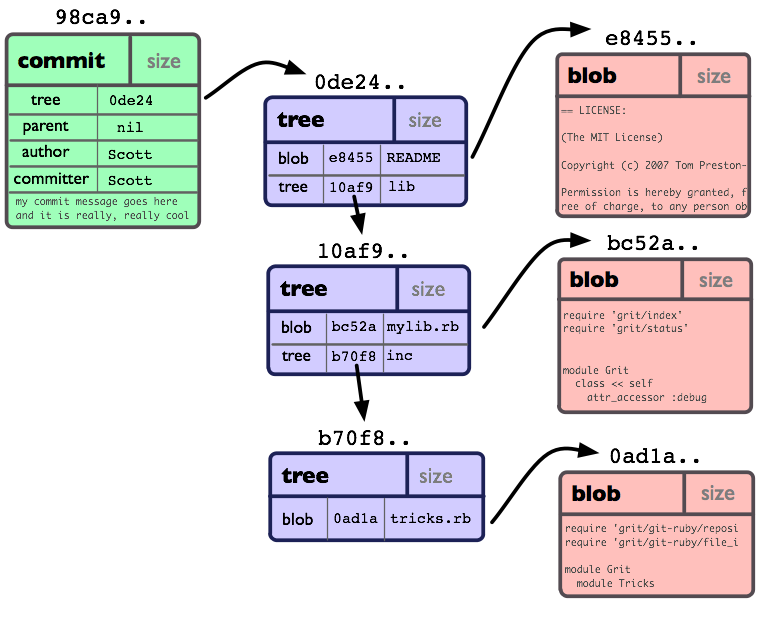
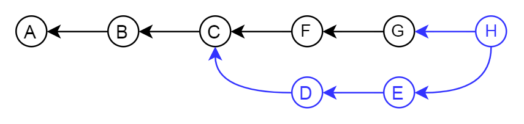
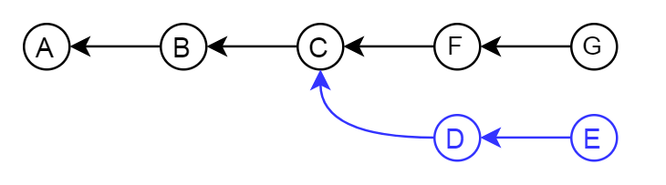
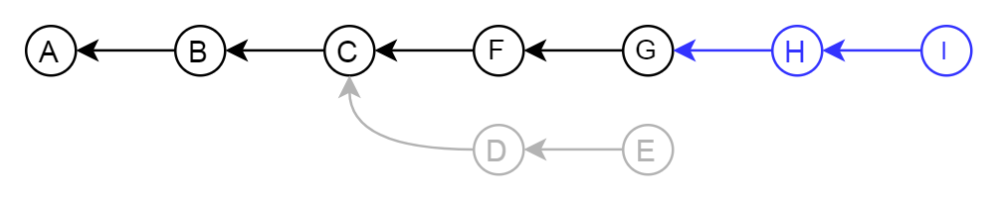

# Understanding Git

Conor Restall &lt;conor@restall.io&gt;

2017-09-04

---

# Introduction

- Ask questions as I go
- If you are reading these slides press `S` to view my speaker notes.

<!--
Teaching principles - not tools
For demos I will solely use the command line. If that's not what you're used to don't fret it's not important to remember what I am typing, it's important to remember the concepts I'm explaining.
There will be some parts where you see me poking around with Git internals.

Not a talk about best practices or how you to use git.

If I get time at I will progress on to breaking down some common and more complex git tasks.

If I start going to fast please stop me.
-->

---

Sound Familiar?

---

# What you're (hopefully) going to learn

- Basic git data structures
- What a commit is
- What a branch is
- What a merge is
- What hashes represent

<!--
Remembering a list of git commands is not good enough

If you don't understand the git principles the git documentation is useless (there is still lots of help out there though)

Help to describe the basic principles of git so that you can apply these in the real world.
So that next time you have a problem in git you should be able to understand what went wrong, you should start to understand what certain commands do.
-->

---

# Fundementals

- DVCS
- Hashes
- .git directory

<!--
Before I move on it's important to understand these 3 things.

Git is a DVCS this means that you store the entire repository locally. Git remotes are there purely to aid sharing code.

Being distributed Git keeps a copy of the repository locally separate to your working copy.

Git uses SHA-1 hashes to represent just about everything. Generally displayed as hex encoded.
`git hash-object somefile`

Something you'll have probably already noticed if you used git for a while is that git sometimes uses short hashes to make things a bit easier.

`git log --oneline` will show history with short hash. `git log` will show history with full hash.
Git will give you enough bits of the hash to identifiy a unique object.

I will come on to what hashes represent later.
Important to get your head around how the hashses work. If you ever change anything in git then the hash will be different, you're not really modifying anything.
Likewise if you have the same hashed object twice it will only be stored once.
This is a bit of a lightbulb moment and other understanding stems from there.

As I'm sure many of you have noticed there is a .git directory at the root of each git project.
The entire repo is stored inside here.
I will delve into this directory a bit, but don't try to manually manipulate it's contents unless you REALLY know what you're doing.
If git is broken it's not really very friendly.
-->

---

# Git Data Model

This is the structure that git uses to store commits.

<!--
Here we see the fundemental building blocks of everything stored in git.

One way direction Commits Point to trees, trees point to others trees and blobs, blobs don't point anywhere.
You can't work you're way back up without lots of searching.

All parts are stored in the same way. So way to differentiate between the different types

All parts are stored in .git/objects

SideNote: if you run `git gc` or `git pack` then they may be stored slightly differently on disk to save space but the underlying principles are the same.

Git is one big interlocked graph. You will hopefully start to see this as we go along.
-->

---

# Commits

Represents a commit - Contain some meta data:

- **tree**: pointer to a tree
- **author**: author details
- **committer**: similar to author (rarely different unless you want them to be)
- **parent**: pointer to a previous commit (initial commit is empty)
- **commit message**: Text that should describe the commit
- occasionally some other meta data

<!--
Tree - just a hash that points to the files in the commit - I'll come on to trees on my next slide.

Author - The person who wrote the code

Committer - the person who commited the code. These are usually the same person. If you are applying someone else's patch.
Most git tools don't differentiate between commiter and author.

Autor and committer fields are usually just also include an Epoch timestamp and timezone

Parent - parent commit. It is possible to have multiple parents - e.g. Merges.
The first commit doesn't have a parent

Lets have a look at a commit.

`git init`

`touch empty.txt`

`git add empty.txt`

`git commit -m 'initial commit - only an empty file'`

Now we have a commit in our git repo lets have a look at it.

There is a useful tool to poking around with these internals that is included in git by default `git cat-file`.

Before we can do that we need the hash of the commit `git rev-parse HEAD` will give us that

`git cat-file commit <hash>`

If we add another empty file and another commit

`touch empty2.txt`

`git add empty2.txt`

`git commit -m 'second commit - another empty file'`

and then look at the second commit we can see a parent

Any questions about commits?
-->

---

# Trees

Represent directories

A tree must point at least 1 other tree or a blob

<!--
Represents directory structure and some permissions

each tree repesents a directory and contains a list of blobs (files) and trees (directories) both identified by their hash

any change to the contents of a directory changes it's hash

Lets have a look at a real repo - using the one we already created

`git cat-file -p <hash>`

Gives us the hash of the tree

`git cat-file -p <hash>`
or
`git ls-tree <hash>`

We can see here our 2 files in the git repo - and their file permissions (it is possible to turn off file permissions)
You'll notice that the 2 files have the exact same hash - this is becuase the files contain byte for byte the same file.

`ls-tree` gives us the root tree node. here we only have 2 files and no directories. Lets add a new directory with a file.

`mkdir dir1`

`touch dir1/empty3.txt`

`git add dir1/empty3.txt`

`git commit -m 'third commit - a third empty file'`

get our new tree hash

`git cat-file commit $(git rev-parse HEAD)`

Now we can see our new directory which is of type tree. For completeness we can have a look inside this directory and see the other file we created.

`git ls-tree <HASH>`
-->

---

# Blobs

- Represent Files
- Tracking starts once you run `git add`
- Stored in `.git/objects/` (along with commits and trees)

<!--
Lets look at one of our files. Firstly lets get the hash of the files

`git ls-tree <TREE-HASH>`

Now we can re-use cat-file to view the contents

`git cat-file blob <BLOB-HASH>`

As expected the file is empty.

Lets add some content to a file

`echo 'some file content' > notEmpty.txt`

Lets watch git and see how it changes as we add this file and commit it.

Firstly lets look to see that the file isn't already tracked by git. We can calculate the hash of the file and see that it's not alredy in git.

`git hash-object notEmpty.txt`

`ls .git/objects/`

All commits, trees and blobs are all stored in `.git/objects/`

Now we can add it to git and see what happens

`git add notEmpty.txt`

`ls .git/objects/c2/e7a8d366fd124ec77d39d3ae8a4904d8c1ad3d`

We can see that git has started tracking the file

At this point it's not in a tree though. It will be referenced in the .git/index.

This object has been compressed using zlib so we can't just look directly at the object

Lets commit this new file and see that it's made it into the tree and a new commit is created.

`git commit -m 'our first non-empty file'`

`git rev-parse HEAD` - to get the latest commit

`git cat-file commit <HASH>`

`git ls-tree <HASH>`

More on what happens when we commit a little later on

Questions?
-->

---

# What does this all mean for git

- Every time you make a change to a file then a new copy of the file is stored in git.
  - This is why git isn't very good at storing large files. Changing 1 byte results in a duplicate file
- Each commit can directly access it's the exact state without having to look through all of history
- If you commit the same file it will only be stored once
- There is nothing special about moving or renaming files

<!--
Much of this is actually pretty transparent when you're using due to gits good merge tooling.

Questions?
-->

---

# Branches and Tags

- Branches are Tags are both `refs`.
- They are pointers to a commit
- By convention tags don't change, branches do

<!--
We can see call branches in
`ls .git/refs/heads`

We can view all tags in
`ls .git/refs/tags`

Refs as a simple as you can get. They are just a text file with the commit hash in.

`cat 'cat .git/refs/master'` matches `git rev-parse HEAD`

At this point we can start to see that everything in git is stored in this connected data structure. Lots of reuse.

Questions?
-->

---

# Annotated Tags

- Special type of tags that contain more information
- Possible to tag any object (commit, tree, blob or even annotated tag)
- Create an additional object
- Point the tag ref at the new object

<!--
Annotated tags provide a mechanism to store additional information about a tag.

This is achieved by creating a tag object it has with target object hash, target object type, tag name, the name of the person ("tagger") who created the tag, a message and possibly taggers signature.
-->

---

# Summary so far

- Refs point at commits
- Commits point at other commits and a tree
- Trees point at blobs
- Blobs are just zipped files

QUESTIONS?

<!--
Important to understand these are all intertwined, but not cyclical.

The structure is a "directed acyclic graph"
-->

---

# Merging

2 Options for merging:

- Fast-forward merge
- Merge Commit

<!--
By default when you merge the first thing git does is figure out if you can do a fast-forward merge.
-->

---

# Fast-forwarding

<!--
A fast-forward merge is when the 2 branches have a shared history and the new commits can be added straight to the branch.

Nothing is actually moved or copied the branch is just changed to point at the new HEAD commit.

You can force the type of merge using `--no-ff` when merging or globally using `git config --global merge.ff false`.

This is sometimes desirable if you want to keep a strict history of when things were branched and merged
-->

---

# Merge commits

---

Merge commits are commits with 2 or more parents

There are a lots or Merge Strategies and each has lots of options

- Resolve
- Recursive (default)
- Octopus (default if you merge more than 2 branches)
- Ours
- Subtree

See [git-scm.com/docs/merge-strategies](https://git-scm.com/docs/merge-strategies) for more info

<!--
https://git-scm.com/docs/merge-strategies
If a branch cannot be fast-forwarded then a Merge commit will be created.

**Resolve** This can only resolve two heads (i.e. the current branch and another branch you pulled from) using a 3-way merge algorithm. It tries to carefully detect criss-cross merge ambiguities and is considered generally safe and fast.

**Recursive** This can only resolve two heads using a 3-way merge algorithm. Additionally this can detect and handle merges involving renames. This is the default merge strategy when pulling or merging one branch.

**Octopus** This resolves cases with more than two heads, but refuses to do a complex merge that needs manual resolution.

**Ours** Ignore all other changes. Even changes to untouched files and new files.

**Subtree** This is a modified recursive strategy. When merging trees A and B, if B corresponds to a subtree of A (actual files), B is first adjusted to match the tree structure of A, instead of reading the trees at the same level. This adjustment is also done to the common ancestor tree.

What happens if one of these merege strategies come across something that can't be automatically merged.
-->

---
layout: image
image: ./images/ahh.gif
---

# MERGE CONFLICT

---

# Merge Conflict

- Occurs when the merge strategy can't figure out what the new file will look like.

<!--
Conflicts sometimes happen because of genuine collisions e.g. a method is refactored in different ways on the 2 branches.
Sometimes they are because the merge stategy doesn't understand what is going on. E.G. 2 new method are added to a class in the same place.

Lets have a look at what is going on when we get a conflict.

Create a branch and make a change

`git checkout -b branchb`

`vim notEmpty.txt`

`git commit -am 'change contents of notEmpty'`

Switch back to master and create a conflicting change

`git checkout master`

`vim notEmpty.txt`

`git commit -am 'make a colliding change to notEmpty'`

Now when we merge we get into a merge conflict state

`git merge branchb`

`git status`

lets us know we're in a conflict state. We can also look at the contents of `.git/`
we can see some new files. There are 2 files that point to the original branch and the branch we tried to merge in and a file called MERGE_MODE that lets us know we are mid merge.

This is what I want to impress onto you. The current state of the git repo is represented by a few text files in this repo. Nothing special or magic. You don't have to know what these files are exactly or precisely how the affect git to understand the simplicity of it.

Lets quickly fix this and commit

`vim notEmpty.txt`

`git add notEmpty.txt`

When we commit we can see that git has generated us a message explaining the merge.

`git commit`

We can also go back an look at this merge commit and see it's 2 parent commits.

`git cat-file commit $(git rev-parse HEAD)`
-->

---

# Config files

Global config `~/.gitconfig`

Repo config `.git/config`

---

# Setting Config

`git config user.email conor@restall.io`

`git config --global init.defaultBranch main`

`git config --global core.excludesFile ~/.gitignore`

---

# Getting Config

`git config user.email`

`git config --global init.defaultBranch`

---

# Viewing Branches

- `git log`
- `git log --graph --oneline`?

<!--
I know I said this isn't a talk on best practices and how to use git but here is the exception because `cat-file` is of course a crazy way to look at history and I don't want to see people manually crawling through commits. Here are some better tools.

`git log` presents a linear history of commits. Add `--oneline` to see a simpler view of history. Displays a flattened graph.

`git log --graph` displays branches, much easier to see what commits were made near to each others.

I'm sure whatever tool you decide to use for git also displays this information in some form or other.
-->

---

# Rebasing

- Controversial
- Rewriting history

<!--
Some people swear by always rebasing, Others swear by never rebasing even to go as far as forcing merges when they can fast forward. Personally I dislike rebasing.

Clean history vs actual history

Rebasing is about replaying changes from a different base.
-->

---

<!--
Example:

We have a branch coming off our master.

Now we want to bring these changes back onto master but we want a linear history (for whatever reason) alternatively it's a way to resolve conflicts.

If a base commit isn't specified. Then git will try to work out where the branch deviated from the target branch.

Changing history isn't as simple as it might seem. Don't forget commits contain entire files so you can't just point your current commit at a new base.

Git will go to the original commits, calculate the diff of what changed and then replay the diff of each commit on top of the new base.
If a conflict is hit the rebase pauses and you'll have to manually solve the conflict.

Change the current branch to point at this new commit.

It's important to be aware that the old commits aren't deleted, they just aren't in the current commit history.

We can then fast-forward these new commits into the original branch. I.E. Update master branch to point at the new head commit.

I'm not going to go into interactive rebasing. But I'll say that it allows you to "change" what was commited.
-->

---

# Working locally

---

# Staging

`git add ...`

---

# Partial adding

`git add . -p`

---

# Resetting

- reset --soft
- reset (--mixed)
- reset --hard

<!--
soft changes repository only
mixed changes the repository and staging area
hard changes working directory
-->

---

# Didn't talk about

- Contents of `.git` directory
- Remotes incl. Pushing and Pulling
- Interactive rebasing & rewriting history
- Hooks
- HEAD detached head
- Signing commits
- Fetch vs Pull vs Switch vs Checkout

<!--
There is of course lots more to know about git, Hopefully I have given you enough of an understanding

Remotes - wanted to include these but ultimately I ran out of time
Interactive Rebasing - Wanted to avoid teaching tools
-->

---

# More Resources

- [git-scm.com/docs](https://git-scm.com/docs/) - Reference Docs
- [git-scm.com/book](https://git-scm.com/book/en/v2/) - Book called "Pro Git" by Scott Chacon and Ben Straub
- [gitimmersion.com](http://gitimmersion.com) - really good resource for learning git
- Google

<!--
The book is really good and is available for free under Creative Commons License

Or Print versions are available

Git is really popular and quite complicated. This has lead to loads of really good online git resources being created.

I know lots of devs learn best by doing. http://gitimmersion.com is a very hands on and simple learning tool.

Hopefully I've given yo enough knowledge that you know what to search for.
-->

---

# Thanks

<!--
Thanks for coming and listening.

I hope it was helpful.

I will share out slides later today

If you have any git questions feel free to ask me at any point

All feedback is much appreciated
-->
